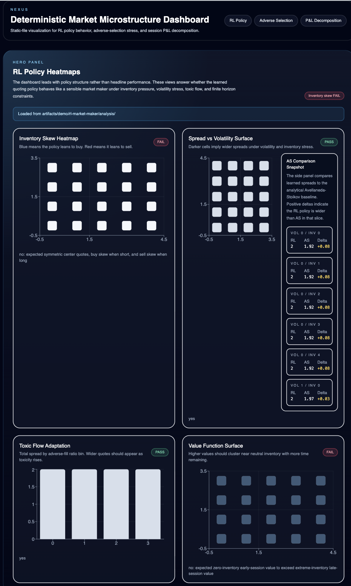

# Multi-Agent-Market-Simulation (NEXUS)

Deterministic continuous double auction simulator. Thread-confined matching engine, four agent types, full session replay. 
Programmed in Java 17.

## Structure

```
engine/     Order book, matching, book integrity assertions
sim/        Clock, deterministic session runner, demo entry points
agent/      AS market maker, RL market maker, informed + noise traders
rl/         State discretizer, Q-table, experience replay, policy export
metrics/    MRR attribution, Kyle's lambda, stylized facts validation
frontend/   React dashboard (Recharts, Tailwind, Vite)
```

## Agents

| Agent | Implementation |
|---|---|
| Avellaneda-Stoikov MM | Closed-form analytical quoting. Serves as the RL baseline. |
| RL Market Maker | Tabular Q-learning, 12-feature state discretizer, 25-action bid/ask offset grid. Falls back to AS policy below 10 state visits. |
| Informed Trader | Directional orders against the true value process. |
| Noise Trader | Random order flow. |

## Frontend

React dashboard (Recharts, Tailwind, Vite) that visualizes simulation artifacts: RL policy heatmaps with AS baseline comparison, adverse selection sweep plots, and MRR P&L attribution breakdowns. Loads JSON/CSV output from the demo runners.




## Matching Engine

Price-time priority via `TreeMap<Integer, PriceLevel>` per side (bids reverse-ordered, asks natural), each level backed by an `ArrayDeque` FIFO queue. All prices in integer cents, all quantities in integer shares. No floating point in the matching path.

**Determinism by construction.** No locks, no concurrent collections, no thread sharing. Trade and resting-order IDs come from monotonic counters. Sessions are seeded via a deterministic SplitMix-style derivation function, so any run is fully reproducible given its seed.

**Runtime invariants.** `assertBookIntegrity()` fires after every `submit()` and `cancel()` on the hot path, not in tests. It verifies the book is never crossed, price-level map keys match stored prices, no empty levels linger, and intra-level FIFO ordering is preserved via strictly increasing `bookSequence`.

**Narrow by design.** Only LIMIT GTC and LIMIT IOC are accepted. MARKET orders and other time-in-force types are rejected at the gate rather than partially handled.

`Order` and `Trade` are immutable records. `RestingOrder` wraps an `Order` and exposes exactly one mutable field (`remainingQuantityShares`).

## Session Runner

`DeterministicSessionRunner` orchestrates the clock, agent callbacks, and fill notifications for a single session. Agents implement a `TradingAgent` interface and receive an `AgentContext` with current market data. The runner is allocation-conscious on the hot path: integer arithmetic throughout, no boxing, no object creation in the tick loop beyond order/trade records.

Three demo runners write to `artifacts/demo/`:

```bash
java -cp target/classes dev.nexus.rl.DeterministicRlDemo
java -cp target/classes dev.nexus.sim.AdverseSelectionSweepDemo
java -cp target/classes dev.nexus.sim.SessionPnlAttributionDemo
```

## Analytics Pipeline

**P&L Attribution.** MRR decomposition of each agent's mark-to-market PnL into spread capture, adverse selection cost, and inventory drag.

**Adverse Selection Sweep.** Scales informed-trader fraction from 0% to 50% across 200 sessions per condition. Collects quoted spread, effective spread, Kyle's lambda, and per-agent PnL. Identifies the breakeven fraction where MM profitability crosses zero.

**Stylized Facts Validation.** Four checks (return autocorrelation, fat tails, volume-volatility correlation, spread distribution), each returning PASS/FAIL/UNSUPPORTED with no silent skips. Six more are explicitly declared unsupported with reasons tied to missing data fields.

## Build and Run

```bash
mvn -q -DskipTests package
mvn test  # 67 tests, 23 test classes

cd frontend && npm install && npm run dev
```

